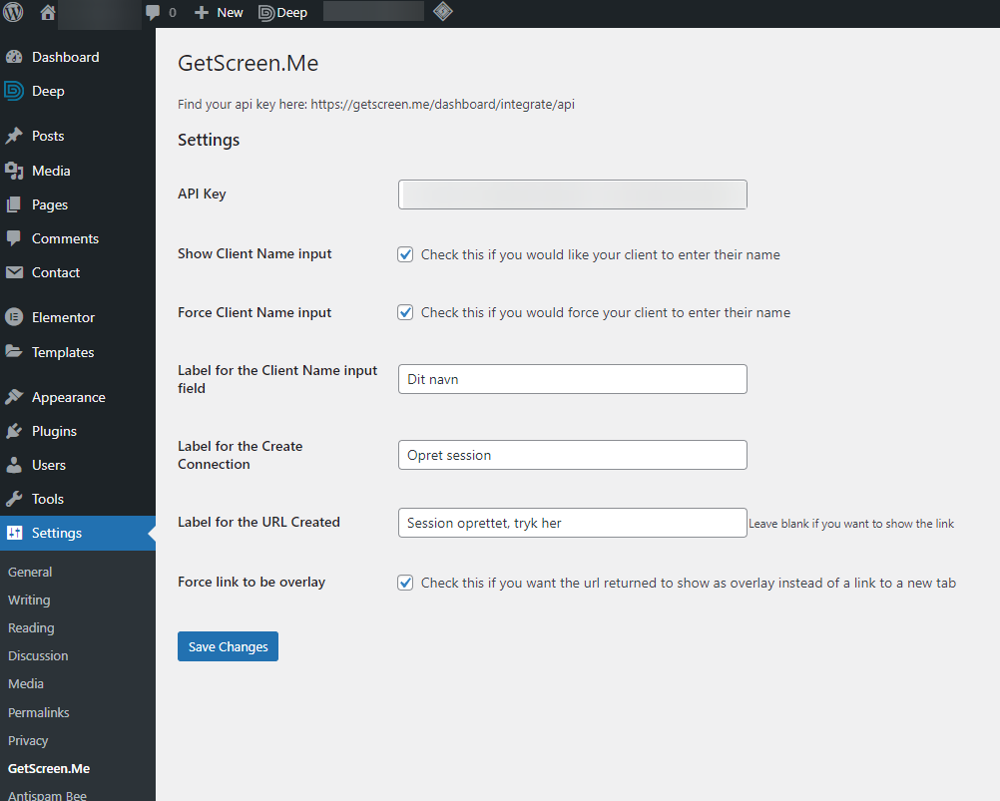
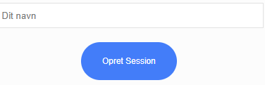

=== Plugin Name ===
Contributors: FantasiaDK

Tags: remote support, client initialization

Requires at least: 5.6

Tested up to: 5.8.2

Stable tag: 1.0

License: GPLv2 or later

License URI: http://www.gnu.org/licenses/gpl-2.0.html

Wordpress plugin for GetScreen.Me, this allows you to have Clients initiate connections.

== Description ==

Wordpress plugin for GetScreen.Me, this allows you to have Clients initiate connections.
It uses shortcode to show a form / button.
The settings are very simple, it needs an API key, that you get on the GetScreen.Me site.

== Installation ==

Download as ZIP and upload it to your Wordpress installation under Plugins > Add.

When added, please activate it, and head for settings > GetScreen.Me and enter your settings.

Add it to your page with the shortcode [getscreenme]

== Changelog ==

= 1.0 =
This is the first version on GitHub.
